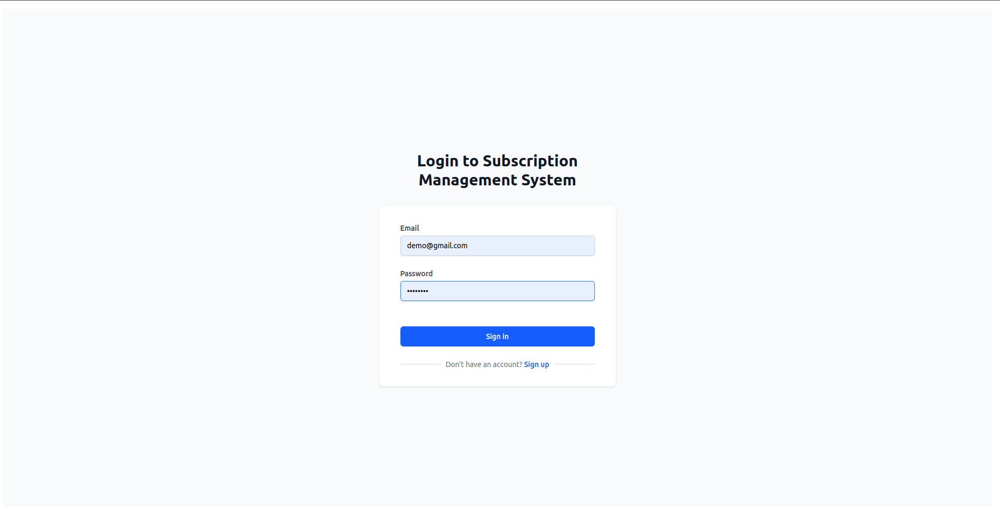
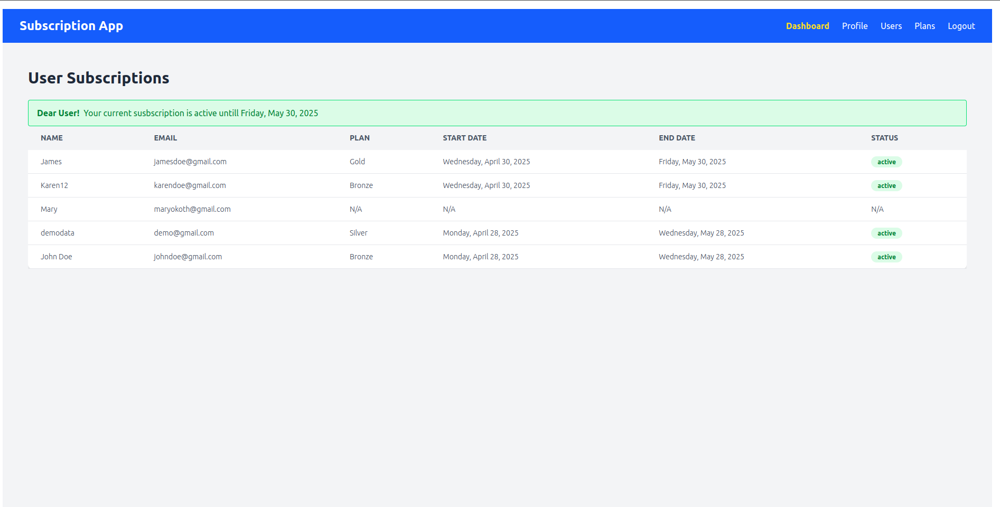
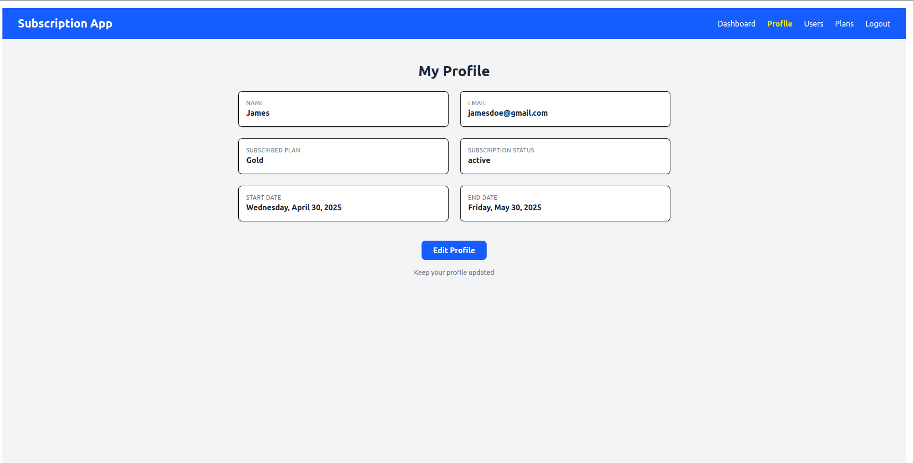
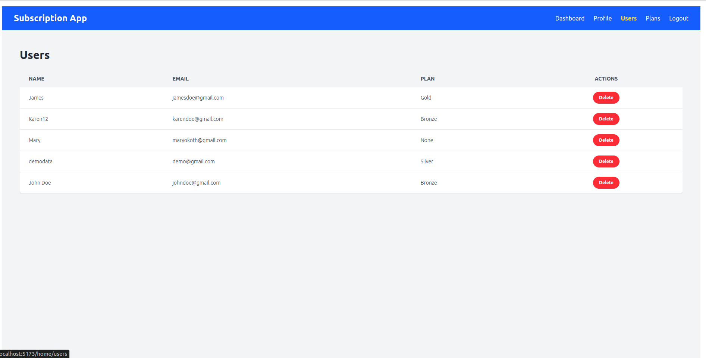
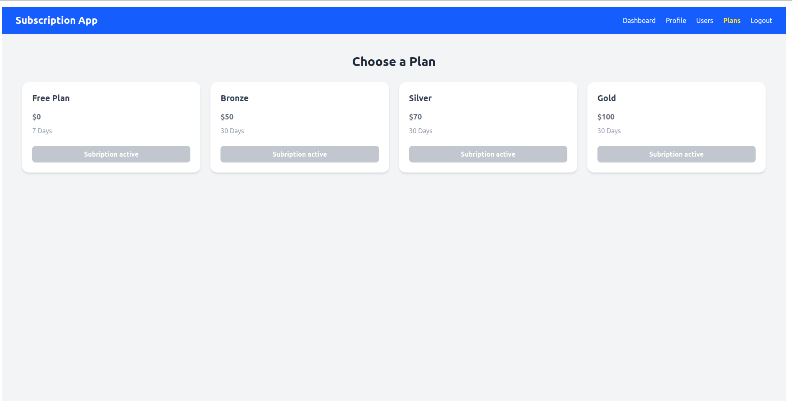

# Subscription Management System - Frontend

Frontend interface for managing users, plans, and subscriptions with real-time status tracking.




## Features
- 👥 **User Management**: Create, view, and delete users
- 📋 **Plan Management**: Define subscription plans with duration/price
- 🔄 **Subscription Flow**: Simulate payments and assign plans
- ⏳ **Expiration Badges**: Visual indicators for subscription statuses
- 📱 **Responsive Design**: Works on desktop and mobile

## Quick Start

### Prerequisites
- Node.js 18+
- Backend server running ([see backend README](#))

  
   
   
   


### Installation
```bash
git clone https://github.com/your/repo.git
cd subscription-frontend
npm install

npm run dev  

src/
├── components/  # Reusable UI components
│   ├── users/
│   ├── plans/
│   └── subscriptions/
├── hooks/       # Custom hooks
├── pages/       # Main views
├── services/    # API service layer
└── utils/       # Helper functions

 ## 🚀 Quick Demo Access

Use these default credentials to test the system:

### Login page
**Email:** johndoe@gmail.com  
**Password:** pass1234

## 🔐 How to Add More Test Users
1. **Via Frontend**:  
   Navigate to `/sign-up` and register new users manually.

## 🔐 How to Edit Your Profile Info
1. **Via Frontend**:  
   Navigate to `/home/profile` click on home and save.

   ## 🔐 How to subscribe a user to a plan
1. **Via Frontend**:  
   Navigate to `/home/plans` or Plans in the NavBar ,select a plan and subscribe.   

   Note: Only users without a plan can subscribe

    ## 🔐 How to delte a user to a 
1. **Via Frontend**:  
   Navigate to `/home/users` or Users in the NavBar ,select a user and click on delete button.   
 

 
